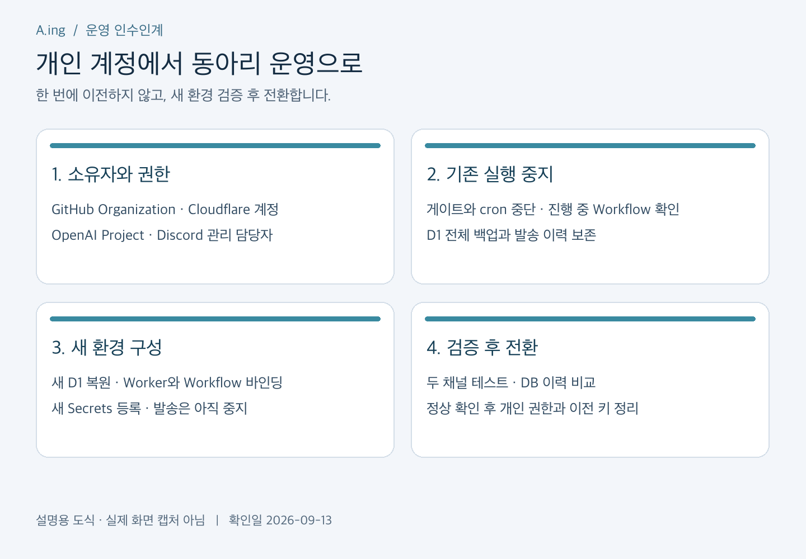
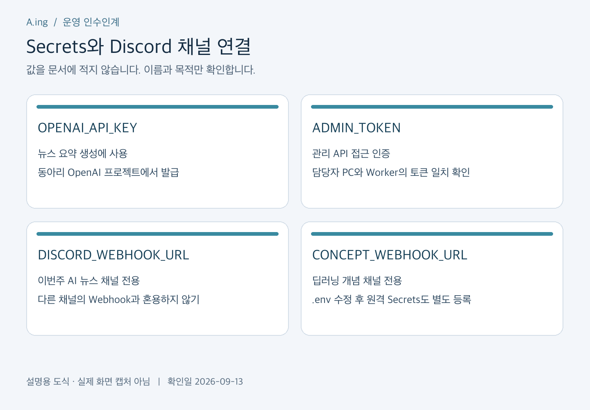

# 동아리 계정 이전 가이드

[실제 설정 화면 12장으로 따라 하기](ACCOUNT_SETUP_SCREENSHOTS.md) — GitHub·Cloudflare·OpenAI의 클릭 순서와 입력 항목.

확인일: 2026-09-13. 이 문서는 이전 실행 절차이며, 계정 이전 완료 기록이 아니다. 현재 실행 경로는 Cloudflare이며 GAS와 Python 서버 운영 문서는 과거 자료다.

## 1. 이전 대상과 담당자

공용 비밀번호를 돌려 쓰기보다 동아리 소유 조직·프로젝트에 담당자 개인 계정을 초대한다. 정·부 담당자를 두고 다음 학기에도 복구 가능한 연락처와 2단계 인증 복구 수단을 관리한다. 비밀 값은 GitHub와 Notion 어디에도 적지 않는다.

| 서비스 | 현재 대상 | 동아리 운영 목표 | 이전 시 확인 |
| --- | --- | --- | --- |
| GitHub | ZEO1122/A.ing-Discord-Bot | 동아리 Organization 소유 저장소 | 관리자·리뷰 담당자, 기본 브랜치 |
| Cloudflare | discord-study-probe Worker·D1·Workflow | 동아리 관리 계정에 새 리소스 구성 | Account ID, D1 ID, Worker URL, 요금제 |
| OpenAI | 개인 API 프로젝트의 키 | 동아리 관리 Organization/Project의 전용 키 | 결제 책임자, 사용량·지출 설정 |
| Discord | 뉴스·개념 채널별 Webhook | 동아리 운영진이 관리 가능한 Webhook | 두 채널 분리, 관리 권한 |
| Notion | 개인 인수인계 페이지 | 현재는 개인 보관, 인계 시 담당자 초대 | 공개 게시하지 않기 |

담당자 실명·연락처·복구 정보의 보관 위치는 비공개 운영 대장에 기록한다. 공개 저장소에는 역할과 절차만 둔다.



*설명용 도식이며 실제 서비스 화면 캡처가 아니다.*

## 2. 이전 전 준비

1. 동아리 GitHub Organization, Cloudflare 계정, OpenAI 프로젝트의 소유자와 결제 담당자를 확정한다.
2. 현재 Git 커밋, 배포 버전, Worker URL, D1 이름, 설정과 Secrets의 **이름만** 기록한다.
3. 뉴스와 개념 채널을 각각 확인한다. 기존 채널을 유지할지 새 채널로 옮길지 정한다.
4. 이전 시간에는 생성·발송을 중지하고 실행 중 Workflow가 끝났는지 확인한다. 새 배포의 게이트를 끄는 것만으로 기존 실행이 중단된다고 가정하지 않는다.
5. D1 전체 백업을 비공개 위치에 보관한다. 발송 이력과 API 예약 기록도 반드시 포함한다.

현재 모든 운영 게이트는 false이고 cron은 없다. 이전 후에도 검증이 끝날 때까지 유지한다.

## 3. GitHub 소유권 변경

1. 현재 새 저장소 `ZEO1122/A.ing-Discord-Bot`를 연다. 과거 `Discord-Bot` 저장소와 구분한다.
2. Settings → General → Danger Zone → Transfer에서 동아리 Organization을 대상으로 지정한다.
3. 대상 Organization의 저장소 생성 권한과 이름 충돌 여부를 확인한 뒤 화면의 확인 절차를 따른다.
4. 이전 완료 후 새 주소로 접속하고 코드·브랜치·권한을 확인한다. 새 담당자를 관리자 또는 필요한 역할로 추가한다.
5. 로컬 remote를 변경하고 README, package.json의 저장소 주소, 문서 링크도 새 주소로 고친다.

```bash
git remote -v
git remote set-url club https://github.com/CLUB_ORG/A.ing-Discord-Bot.git
git fetch club
git status
```

`CLUB_ORG`는 실제 조직명으로 바꾼다. 현재 문서 작성 브랜치는 `codex/concept-notifications`다. 기본 브랜치는 GitHub 화면에서 별도로 확인한다. 기존 old origin의 main·태그·과거 커밋을 새 저장소로 밀어 넣지 않는다. 과거 이력에서 민감정보 패턴이 발견되어 새 이력으로 분리한 저장소다.

공식 절차: [GitHub 저장소 이전](https://docs.github.com/en/repositories/creating-and-managing-repositories/transferring-a-repository).

## 4. Cloudflare 새 계정 구성과 데이터 이전

계정 이름만 변경하는 방식 대신 새 계정에 Worker·Workflows·D1을 구성하는 것을 기준으로 한다. 기존 D1 파일을 덮어쓰거나 실행 중 작업을 복제하지 않는다.

1. Cloudflare 계정의 Members에서 정·부 담당자를 초대한다. 각자 로그인하고 대상 계정을 확인한다.
2. 기존 계정에서 생성·발송 게이트를 끄고 cron을 제거한다. Workflow 실행 목록에서 진행 중 작업을 확인하고 종료·중단 결과를 기록한다.
3. 기존 D1을 전체 SQL로 export한다. 출력 파일은 저장소 밖의 보호된 디렉터리에 보관한다.
4. 새 계정으로 Wrangler 로그인 후 새 D1을 만든다. `cloudflare/wrangler.jsonc`의 `account_id`, D1 `database_id`를 새 값으로 지정한다. `DB` 등 코드가 사용하는 binding 이름은 유지한다.
5. 빈 새 DB에 전체 SQL을 import한다. 전체 백업의 스키마와 migration 이력도 확인한다. 이미 스키마가 있는 DB에 전체 SQL과 초기 migration을 중복 적용하지 않는다.
6. Worker와 PROBE/WEEKLY Workflow 바인딩, Secrets를 구성하고 모든 게이트가 false인 상태로 배포한다.
7. 이전 전후 테이블별 행 수, 주차별 발송 상태, 학기·슬롯 수, migration 이력을 비교한다.

아래 명령은 실제 이전 때 대상 계정을 확인하고 실행하는 예시다. 문서 작성 과정에서는 실행하지 않았다.

```bash
npx wrangler whoami
npx wrangler d1 export discord-study-probe --remote --output /PRIVATE_BACKUP/club-bot.sql --config cloudflare/wrangler.jsonc
# 새 계정 로그인 및 account_id 지정 후 실행
npx wrangler d1 create discord-study-probe --config cloudflare/wrangler.jsonc
# 새 database_id를 설정한 후 빈 DB에 복원
npx wrangler d1 execute discord-study-probe --remote --file /PRIVATE_BACKUP/club-bot.sql --config cloudflare/wrangler.jsonc
```

`/PRIVATE_BACKUP`은 실제 비공개 경로로 바꾼다. 백업은 Git, PR 첨부, Notion에 올리지 않는다. D1 백업에는 Workflow 실행 자체의 이력이 포함되지 않으므로 진행 중 작업은 별도로 정리한다.

현재 일부 도구는 개인 Worker 주소를 고정 사용한다. 새 계정 테스트 전에 `scripts/content/remote.mjs`, `cloudflare/scripts/observe.mjs`, `preview-live.mjs`의 주소를 수정해야 한다. `weekly.mjs`는 `--remote https://NEW_WORKER.workers.dev`를 지원한다. `metrics.mjs`는 계정이 여러 개면 실행을 거부하므로 그 경우 Dashboard에서 확인한다. 이 도구 정리는 실제 이전의 선행 작업이다.

공식 자료: [계정 구성원](https://developers.cloudflare.com/fundamentals/manage-members/), [D1 백업·복원](https://developers.cloudflare.com/d1/best-practices/import-export-data/), [Wrangler 설정](https://developers.cloudflare.com/workers/wrangler/configuration/).

## 5. OpenAI와 Secrets 변경

1. 동아리 관리 OpenAI Organization에서 전용 Project를 만들고 운영 담당자를 초대한다.
2. 프로젝트의 API Keys 또는 Service accounts에서 운영용 키를 발급한다. 필요한 권한만 부여하고 발급 직후 비밀 저장소에 보관한다.
3. 결제 수단과 사용량 확인 담당자를 정한다. 지출 알림과 강제 차단 설정은 서로 구분하여 실제 계정의 설정을 확인한다.
4. 새 키를 로컬 `.env`의 `OPENAI_API_KEY`에 넣는다. 공개 문서에는 키 값을 적지 않는다.
5. 새 Worker에 OpenAI 키와 새 관리 토큰을 등록한다. 아래 명령은 둘을 함께 등록한다.

```bash
npm run cf:secrets
```

이 스크립트는 `.env`를 읽고 Secrets를 stdin으로 보낸다. 관리 토큰은 로컬 `cloudflare/.wrangler/admin-token`에서 읽으며 파일이 없으면 새로 만든다. 다른 담당자 PC에서 무심코 실행하면 관리자 토큰이 바뀔 수 있으므로 최초 설정·의도한 회전 때만 실행한다. 기존 OAuth 세션 파일을 다른 사람에게 전달하지 않는다.

Dashboard로 변경할 때는 Workers & Pages → 대상 Worker → Settings → Variables and Secrets에서 Secret을 추가·수정하고 반영한다. 로컬 `.env`를 바꾼 것만으로 원격 값이 바뀌지 않는다.

공식 자료: [OpenAI 프로젝트·서비스 계정](https://help.openai.com/en/articles/9186755), [Cloudflare Secrets](https://developers.cloudflare.com/workers/configuration/secrets/).



*설명용 도식. 키와 Webhook의 실제 값은 표시하지 않는다.*

## 6. Discord 관리 권한과 Webhook 변경

1. 서버 운영진이 대상 채널의 Webhook을 관리할 수 있는지 확인한다.
2. 서버 설정의 Integrations → Webhooks에서 뉴스용과 개념용 Webhook을 각각 만든다. 각 Webhook의 Channel을 반드시 확인한다.
3. 뉴스 URL은 `.env`의 `DISCORD_WEBHOOK_URL`, 개념 URL은 `CONCEPT_WEBHOOK_URL`에 각각 저장한다.
4. 새 Worker를 대상으로 Secrets를 등록한다.

```bash
node cloudflare/scripts/secrets.mjs --discord
node cloudflare/scripts/secrets.mjs --concept
```

5. 테스트 목적·채널·콘텐츠를 확인하고 각 채널에 한 번씩 검증 발송한다. 과거 뉴스의 `sent` 기록을 삭제해서 재발송하지 않는다.
6. 새 운영이 정상인 것을 확인한 후 더 이상 쓰지 않는 Webhook과 개인 키를 폐기한다.

Webhook 관리를 위해 Discord 서버 소유권까지 반드시 이전할 필요는 없다. 서버 소유권도 넘길 경우 별도 소유자 결정을 거쳐 진행한다. [Webhook 공식 안내](https://support.discord.com/hc/en-us/articles/228383668-Intro-to-Webhooks), [서버 소유권 이전](https://support.discord.com/hc/en-us/articles/216273938-How-to-Transfer-Ownership-of-a-Discord-Server).

## 7. 전환 완료 기준과 복구

- [ ] 새 담당자가 개인 개발자의 로그인 없이 저장소·Cloudflare·OpenAI에 접근한다.
- [ ] 새 Worker의 미리보기와 인증이 정상이다.
- [ ] 두 채널의 검증 메시지와 발송 이력이 일치한다.
- [ ] DB의 이전 발송·API 예약 기록이 보존됐다.
- [ ] 이전 Worker의 자동 실행은 꺼져 있다.
- [ ] 새 계정의 비용·복구 담당자와 토큰 보관 위치가 기록됐다.
- [ ] 정해진 확인 기간이 지난 뒤 개인 계정 권한과 미사용 키를 회수했다.

실패하면 새 환경의 발송을 먼저 멈추고 원인을 확인한다. 새 환경에서 이미 발송했다면 그 이력을 이전 환경에 대조한 뒤 복귀한다. 오래된 DB 백업을 그대로 되돌려 발송 기록을 없애면 중복 알림이 생길 수 있다. 코드 배포 복구와 DB 복구는 별개다.

운영 후 절차는 [유지보수 매뉴얼](MAINTENANCE_GUIDE.md), 장애 대응은 [운영·복구](OPERATIONS.md)를 따른다.
