# 실제 화면으로 따라 하는 계정 설정

촬영일: 2026-09-13. Computer Use로 로그인된 GitHub, Cloudflare, OpenAI Platform 화면을 직접 열어 촬영했다. 합성 화면이 아니다. 개인정보가 있는 주변 영역은 캡처에서 제외했다. 입력창은 비워 두었으며 실제 이전·초대·키 발급·배포·결제 변경은 실행하지 않았다.

기존 [계정 이전 가이드](ACCOUNT_MIGRATION.md)의 백업·전환 순서와 함께 읽는다. 이 문서는 **로그인 후 설정 화면** 안내다. 회원가입·인증·결제 완료 화면과 실제 이전 완료 화면은 촬영 범위에 포함하지 않는다. 메뉴 언어와 계정 권한에 따라 화면은 달라질 수 있다.

## 1. GitHub: 저장소 설정 열기

1. [현재 저장소](https://github.com/ZEO1122/A.ing-Discord-Bot)를 연다.
2. 상단 **Settings**를 누른다.
3. 왼쪽 **General**을 선택한다. Repository name이 `A.ing-Discord-Bot`인지 확인한다.
4. Default branch가 현재 `codex/concept-notifications`인 것을 확인한다. 소유권 이전을 위해 브랜치 이름을 바꿀 필요는 없다.

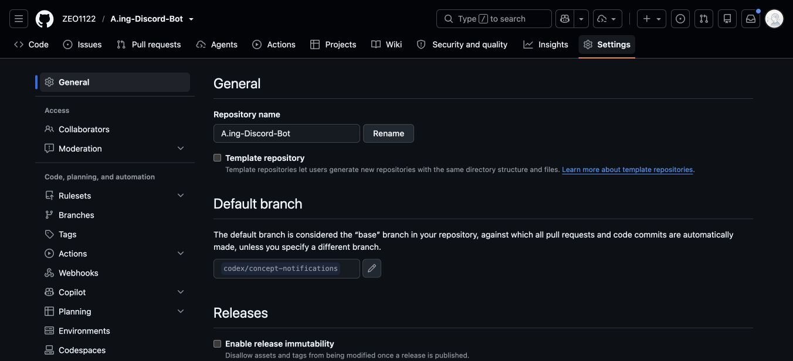

## 2. GitHub: 소유권 이전 메뉴 찾기

1. General 페이지 맨 아래 **Danger Zone**까지 스크롤한다.
2. **Transfer ownership** 행의 **Transfer**를 누른다. 다음 단계의 입력 화면이 열린다.
3. 가까이 있는 Delete this repository나 Archive는 이전 메뉴가 아니므로 선택하지 않는다.

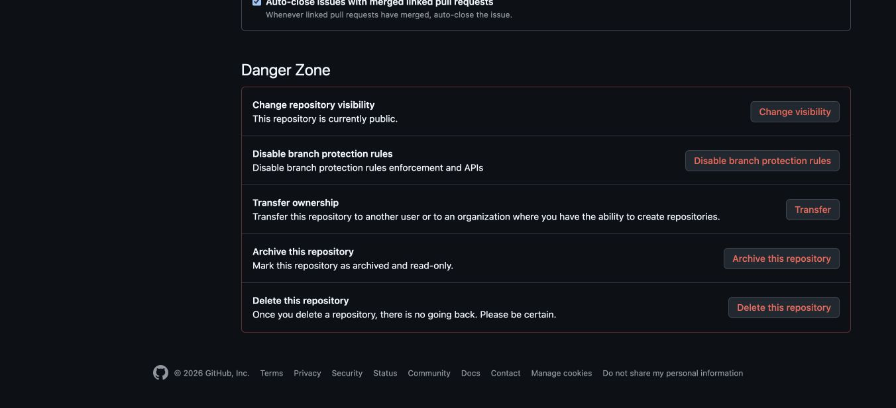

## 3. GitHub: 새 소유자 지정하기

1. **Select one of my organizations → Choose an owner**에서 동아리 Organization을 선택한다.
2. 직접 지정해야 한다면 **Specify an organization or username**을 선택하고 정확한 대상 이름을 입력한다.
3. 확인 입력란에는 화면에 요구된 `ZEO1122/A.ing-Discord-Bot`를 입력한다.
4. **I understand, transfer this repository.**는 실제 이전을 실행하는 버튼이다. 동아리 대상·권한·백업을 확인한 뒤 소유자가 실행한다. 이번 촬영에서는 누르지 않았다.
5. 이전 후 새 주소, 접근 권한, 기본 브랜치를 확인하고 로컬 `club` remote도 새 주소로 바꾼다. 상대의 수락이 필요할 수 있다.

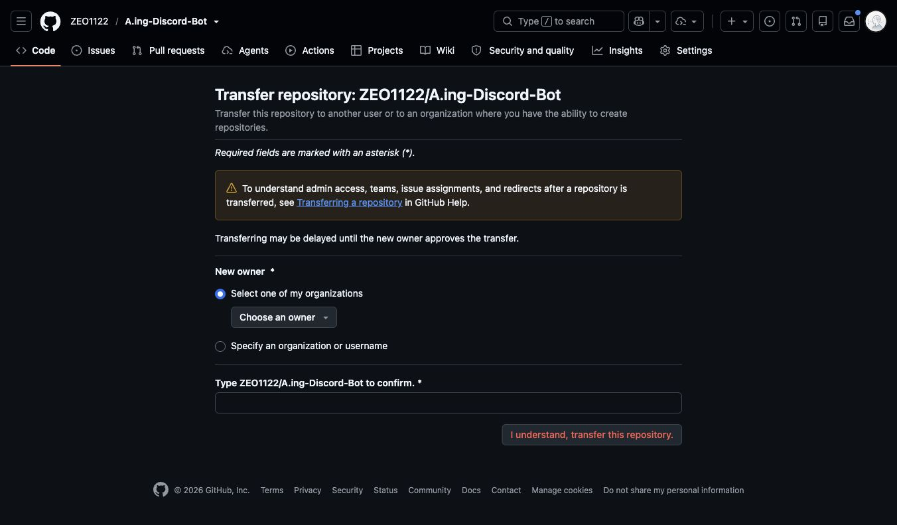

동아리 Organization이 없으면 먼저 조직을 준비해야 한다. 이 화면은 조직을 새로 만드는 화면이 아니다. 과거 `Discord-Bot` 저장소의 이력과 태그는 새 저장소에 push하지 않는다.

## 4. GitHub: 유지보수 담당자 추가하기

1. **Settings → Collaborators → Add people**을 누른다.
2. **Find people**에 새 담당자의 GitHub 사용자명을 입력하고 일치하는 계정을 확인한다.
3. **Add to repository**는 실제 초대를 보내므로 대상과 권한을 확인한 뒤 실행한다. 촬영에서는 검색·초대를 하지 않았다.
4. 상대가 수락한 후 접근 상태를 확인한다. Organization 소유 저장소에서는 Teams 또는 조직 권한 화면이 추가될 수 있다.

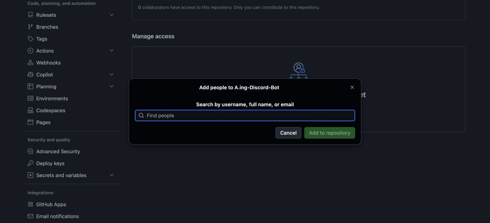

## 5. Cloudflare: 담당자 초대 화면 열기

1. [Cloudflare Dashboard](https://dash.cloudflare.com/)에 로그인한다.
2. 왼쪽 위 계정 선택기에서 **동아리 운영 계정**을 고른다. 개인 계정의 이름만 바꾸는 것으로 리소스 이전이 완료되지는 않는다.
3. 왼쪽 **계정 관리 → 구성원 → 구성원 초대**를 누른다.
4. **이메일 주소 추가**에 초대할 담당자의 이메일을 입력한다. 아래 사진의 example.com은 서비스의 빈 입력창 예시다.

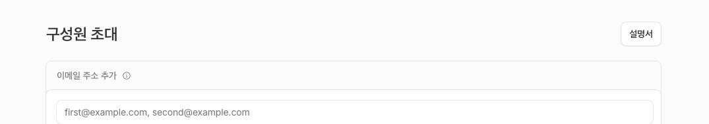

## 6. Cloudflare: 초대 권한 정하기

1. 이메일 입력 아래 **권한 정책 추가**에서 적용할 계정과 범위를 확인한다. 개인정보가 표시되는 계정명 영역은 사진에서 제외했다.
2. **역할 할당**에서 필요한 역할을 찾는다. 검색창으로 역할을 좁힐 수 있다.
3. **Super Administrator - All Privileges**는 구성원·결제 등 계정 전체를 관리하는 권한이다. 모든 콘텐츠 작성자에게 주지 않고 계정 소유·복구 책임자에게 필요한지 판단한다.
4. 배포 담당자는 Workers·D1·Workflows 등 실제 작업에 필요한 역할과 범위를 검토한다. 사진의 전체 역할 토글을 한꺼번에 켜지 않는다.
5. 화면 하단 정책 생성·구성원 초대 단계는 실제 권한을 부여한다. 대상과 역할을 확정한 뒤 실행하고 수락 여부를 확인한다. 촬영에서는 역할 선택이나 초대를 실행하지 않았다.

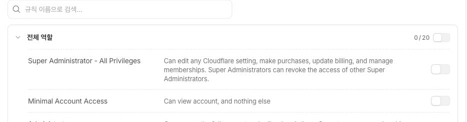

새 계정의 Worker·D1은 [이전 가이드](ACCOUNT_MIGRATION.md)의 Wrangler 배포·전체 백업 복원 순서로 구성한다. 이 프로젝트는 Dashboard에서 빈 Hello World Worker를 만들고 끝내는 방식이 아니다.

## 7. Cloudflare: Worker의 Secrets 위치 찾기

1. 왼쪽 **컴퓨트 → Workers 및 Pages**를 연다.
2. 대상 Worker **discord-study-probe**를 선택한다.
3. 상단 **설정** 탭에서 **Runtime variables and secrets**를 확인한다.
4. 신규 등록은 오른쪽 **변수 추가**, 기존 항목 변경은 해당 행의 연필 버튼이다.
5. 비밀 값은 **암호화된 값**으로 표시된다. API 키·관리 토큰·두 Webhook은 비밀 항목이어야 한다.

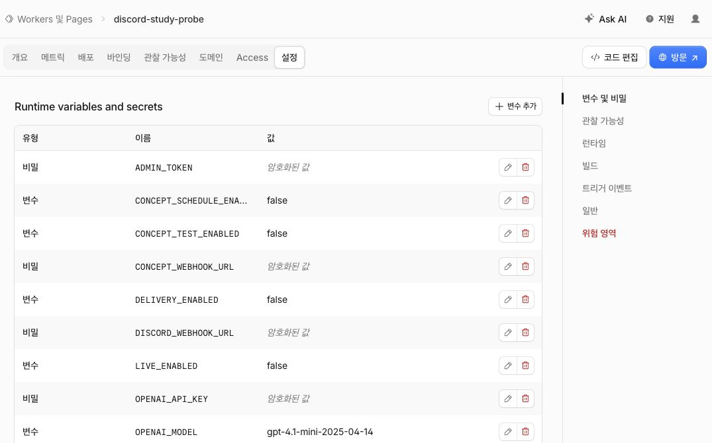

사진에서 운영 게이트가 false인 것은 현재 의도한 상태다. 계정 설정을 위해 임의로 true로 바꾸지 않는다.

## 8. Cloudflare: Secret 입력·배포하기

1. **변수 추가**를 누르면 아래 창이 열린다.
2. **키**에 등록할 변수 이름을 정확히 입력한다.
3. **값**에 해당 비밀 값을 입력하고 오른쪽 **비밀**을 체크한다. 비밀을 체크하지 않으면 일반 변수로 등록될 수 있다.
4. **Add variable and deploy**는 실제 설정 저장과 배포를 실행한다. 값과 대상 Worker를 확인한 후 수행한다. 촬영에서는 빈 폼만 열었다.
5. 저장 후 목록에서 유형이 비밀인지 확인한다. `.env` 파일만 고친 것으로 원격 설정이 바뀌지는 않는다.

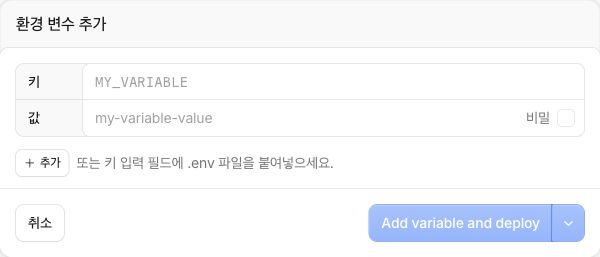

- `OPENAI_API_KEY`: 동아리 OpenAI 프로젝트의 운영 키.
- `ADMIN_TOKEN`: 관리 API 인증 토큰. 담당자 로컬 도구와 동일해야 한다.
- `DISCORD_WEBHOOK_URL`: 이번주 AI 뉴스 채널 Webhook.
- `CONCEPT_WEBHOOK_URL`: 딥러닝 개념 채널 Webhook.

동일 이름이 이미 있으면 신규 추가 대신 해당 행의 편집 기능을 사용한다. `.env` 전체를 폼에 붙여넣지 말고 필요한 항목만 다룬다. CLI 설정 방식은 기존 매뉴얼의 `cf:secrets`를 참고한다.

## 9. OpenAI: 운영 프로젝트 만들기

1. [OpenAI Platform](https://platform.openai.com/)에 로그인한다.
2. 왼쪽 아래 Organization 선택기에서 운영할 조직을 확인한다. **Personal 조직에 프로젝트만 만들면 동아리 소유권 이전이 완료되는 것은 아니다.** 조직의 관리·결제 책임자를 먼저 확정한다.
3. 왼쪽 위 프로젝트 선택기 → **Create project**를 누른다.
4. **Name**에 예를 들어 `Aing-Discord-Bot`처럼 용도를 알 수 있는 이름을 입력한다.
5. **Create**를 누르면 프로젝트가 생성된다. 이번 촬영에서는 누르지 않았다. 생성 후 프로젝트 선택기에 새 이름이 표시되는지 확인한다.

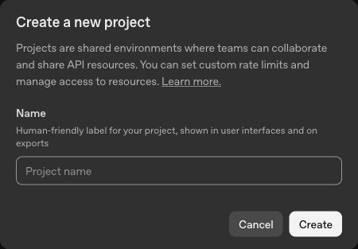

## 10. OpenAI: 프로젝트 담당자 추가하기

1. 운영 프로젝트를 선택하고 **Settings → Members → Add member**를 누른다.
2. 조직 내 사용자는 **Select user**, 이메일로 지정하려면 **Enter user email**을 고른다.
3. **Email**에 대상 이메일을 입력하고 **Role**을 확인한다. 사진은 Member를 기본 표시한다.
4. **Add member**는 실제 권한 추가 버튼이다. 대상과 역할을 확정한 뒤 실행한다. 조직 멤버 등록이 먼저 필요한 계정은 Organization settings에서 처리한다.
5. 추가 후 Members에서 대상이 보이는지 확인한다. 이번 촬영에서는 누구도 초대하지 않았다.

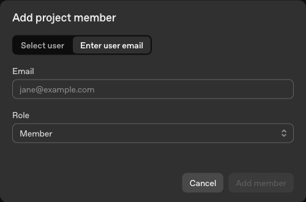

## 11. OpenAI: 운영용 API 키 발급하기

1. 운영 조직과 프로젝트를 다시 확인하고 왼쪽 **API Keys → Create new secret key**를 누른다.
2. **Owned by**를 선택한다. You는 개인 사용자에 묶이며 해당 사용자가 프로젝트에서 제거되면 키가 비활성화될 수 있다. 동아리 장기 운영은 Service account 방식을 검토한다.
3. **Name**은 `aing-news-worker`처럼 용도를 드러내게 적고 **Project**는 동아리 프로젝트를 고른다. 사진의 Default project를 그대로 따라 선택하지 않는다.
4. 만료 정책을 정하고 Permissions를 검토한다. Restricted를 사용할 때 실제 생성에 필요한 쓰기 권한을 확인한다. Read only로는 요약 생성이 되지 않는다.
5. **Create secret key**를 누르면 실제 자격증명이 만들어진다. 이번 촬영에서는 누르지 않았다. 이후 화면에 표시되는 키는 직접 비밀 저장소와 Cloudflare Secret에 보관하고 캡처하지 않는다.
6. 새 키로 검증한 후 이전 개인 키를 폐기한다. 키 폐기부터 하면 운영이 중단될 수 있다.

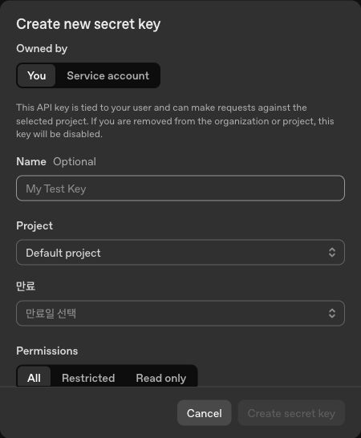

사진은 You 선택 상태의 입력창이다. Service account 선택 후 달라지는 입력 항목과 키 생성 결과 화면은 이 캡처에 포함되지 않는다.

## 12. OpenAI: 월 지출 한도 설정하기

1. 운영 프로젝트에서 **Settings → Limits → Set spend limit**을 누른다.
2. **Monthly spend limit**에 동아리가 정한 월 한도를 달러로 입력한다. 사진의 100은 빈 입력창의 표시이며 이 프로젝트에 권장하는 금액이 아니다.
3. **Enforce a hard limit**을 사용할지 결정한다. 지출 금액 설정과 강제 제한 옵션을 구분해 확인한다. 사용량 집계·적용 조건은 실제 계정의 설명을 함께 확인한다.
4. **Set spend limit**을 눌러야 저장된다. 이번 촬영에서는 금액·옵션을 변경하거나 저장하지 않았다.
5. 저장 후 Limits와 Usage를 확인하고 한도 도달 시 알림이 중단될 수 있다는 점을 운영진에게 공유한다. 결제 수단이나 크레딧 구입은 별도의 Billing 작업이다.

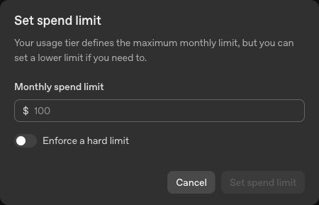

## 캡처를 나중에 갱신하는 방법

1. 해당 설정 화면을 다시 열고 제목·메뉴·입력 항목이 바뀌었는지 확인한다.
2. 이메일·API 키·기존 키 목록·청구 정보가 없는 영역만 캡처한다. 저장된 값 표시나 키 생성 결과 화면은 촬영하지 않는다.
3. `docs/images/account-setup/`의 대응 JPG를 교체하고 이 문서의 클릭 순서와 촬영일을 고친다.
4. GitHub에 반영한 뒤 Notion 대응 이미지 블록도 새 파일로 교체한다. 이전 이미지의 공개 URL만 바꾸는 방식에 의존하지 않는다.
5. 도식은 전체 흐름을 이해하는 보조 자료이고, 실제 클릭 단계는 이 문서를 우선한다.
