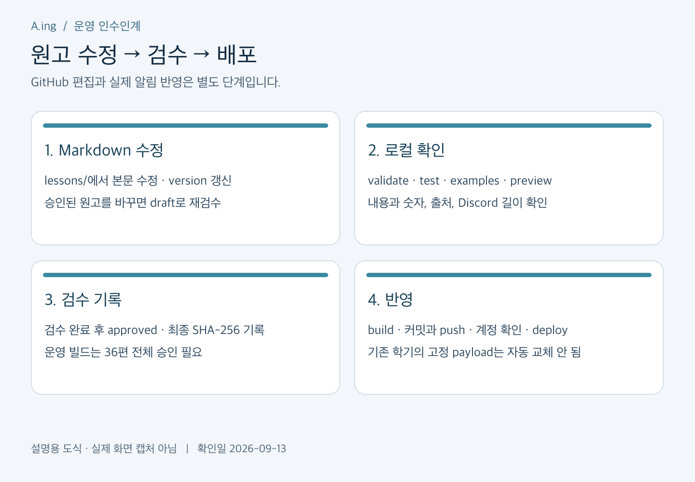
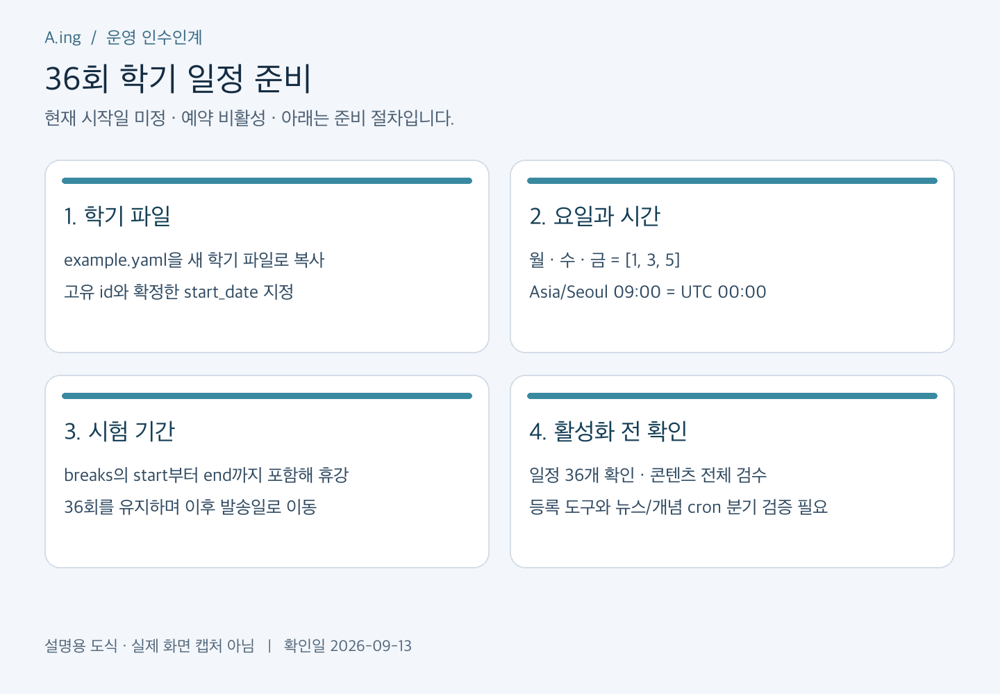

# 유지보수 매뉴얼

[실제 설정 화면 12장으로 따라 하기](ACCOUNT_SETUP_SCREENSHOTS.md) — GitHub·Cloudflare·OpenAI의 클릭 순서와 입력 항목.

확인일: 2026-09-13. Cloudflare 구현 기준. 처음 맡은 담당자는 [한 장 운영 안내](ONE_PAGE_OPERATIONS.md)부터 읽는다. 계정 이전은 [별도 절차](ACCOUNT_MIGRATION.md)를 따른다.

## 1. 현재 운영 상태

뉴스는 Hugging Face 주간 순위 상위 3편을 고정 수집하고 OpenAI로 요약한 뒤 Discord에 보낸다. 개념 알림은 저장소의 Markdown 36편을 빌드하여 배포하므로 발송할 때 OpenAI나 GitHub에 접속하지 않는다.

모든 게이트는 false이며 cron은 없다. 36편은 draft이고 검수 기록은 비어 있다. 학기 시작일·시험 기간은 미정이다. 문서의 날짜 예시는 운영 승인 날짜가 아니다.

## 2. 새 PC 준비

1. Git, Node 24, Python 3와 NumPy를 준비한다.
2. 현재 저장소를 clone하고 실제 운영 브랜치를 확인한다. 기존 담당자의 `.git` 전체를 복사하지 않는다.
3. `npm ci`로 lockfile 기준 의존성을 설치한다.
4. 원격 작업이 필요할 때 본인 Cloudflare 계정으로 `npx wrangler login`을 실행한다. `npx wrangler whoami`로 대상 계정을 확인한다.
5. 필요한 비밀은 지정한 안전한 경로로 받는다. `.env`, OAuth 파일, 관리자 토큰은 Git에 넣지 않는다.

```bash
git clone https://github.com/ZEO1122/A.ing-Discord-Bot.git
cd A.ing-Discord-Bot
git branch -a
npm ci
npm run content:validate
npm run content:test
npm run content:examples
```

현재 문서 브랜치는 `codex/concept-notifications`이며, 동아리 조직으로 이전한 뒤 clone 주소도 바꾼다. 이 단계에는 배포나 Discord 발송이 없다.

## 3. GitHub에서 개념 내용 수정



*설명용 도식. GitHub 수정만으로 Discord 내용이 자동 변경되지는 않는다.*

1. GitHub 저장소에서 브랜치를 확인하고 `content/dl-foundations/lessons/`의 수정할 `.md` 파일을 연다.
2. 연필 모양 Edit 버튼으로 수정한다. 제목만 보고 파일을 새로 만들지 말고 `curriculum.yaml`의 lesson ID와 연결을 확인한다.
3. 의미가 바뀌면 `version`을 올린다. 이미 승인된 글을 수정했다면 `status: draft`로 되돌리고 재검수한다. ID와 order는 단순 오탈자 수정으로 바꾸지 않는다.
4. 아래 여섯 제목을 유지한다. 본문은 글머리 기호와 구체적인 설명을 중심으로 작성한다. AI 전문 용어는 영어 원문을 유지하고, 이모지는 쓰지 않는다.
5. Preview에서 문단을 확인하고 Commit changes에서 작업 브랜치를 만든 뒤 PR로 검토받는다. GitHub Markdown Preview와 실제 Discord 임베드 배치는 다르므로 로컬 미리보기까지 확인한다.

필수 본문 구조:

```markdown
## 오늘의 핵심
## 왜 필요한가?
## 작동 원리
## 작은 예제로 확인하기
## 자주 하는 오해
## 복습 질문
```

출처는 frontmatter의 구조화된 `sources`를 유지한다. 세 참고서에 근거해 직접 설명하며 원문을 길게 복사하지 않는다. 복습 질문에는 미래 채점용 정답 데이터나 채점 로직을 섞지 않는다. 허용 길이를 넘으면 검증이 실패하므로 내용을 재구성하며 임의로 잘라 보내지 않는다.

공식 편집 안내: [GitHub 파일 수정](https://docs.github.com/en/repositories/working-with-files/managing-files/editing-files).

## 4. 로컬 검증·검수·배포

```bash
npm run content:validate
npm run content:test
npm run content:examples
npm run content:preview
npm run content:build
npm run cf:typecheck
npm run cf:test
npm run cf:build
```

`artifacts/concepts/preview.html`을 브라우저에서 연다. 수식, 숫자 예제, 줄바꿈, 출처와 질문을 실제 원고와 비교한다. 산술 검사는 내부 예제 상수를 검증하므로 Markdown 숫자를 고친 경우 검사 코드의 상수도 비교해야 한다.

검수자는 [콘텐츠 검수 기록](CONCEPT_CONTENT_REVIEW.md)을 참고해 내용과 출처를 확인한다. 승인할 때는 최종 파일을 `status: approved`로 바꾼 뒤 SHA-256을 구하고 `content/dl-foundations/reviews.yaml`에 lesson ID별로 `sha256`, `reviewer`, `date`을 기록한다. 필드의 정확한 형식은 [개념 알림 규격](CONCEPT_NOTIFICATIONS.md)의 검수 예시를 따른다. 공백 변경도 해시를 바꾸므로 해시 생성 후 본문을 고치면 다시 계산한다.

```bash
npm run content:build -- --production
```

36편 전체가 승인되어야 통과한다. 현재는 전부 draft라 실패하는 것이 정상이다. 통과시키기 위해 검수자 이름을 임의로 넣거나 해시 검사를 우회하지 않는다.

변경된 Markdown과 생성된 `cloudflare/src/generated/concepts.json`을 함께 검토·커밋한다. `.env`, 토큰, artifacts, D1 백업이 staged 목록에 없는지 확인한다. 검증된 커밋을 push한 뒤 올바른 Cloudflare 계정을 확인하고 배포한다.

```bash
git diff --stat
git diff --cached --name-only
npx wrangler whoami
npm run cf:deploy
```

배포 명령은 개념 빌드를 포함한다. 일반 빌드는 draft도 포함할 수 있으므로 운영 시작 시 production 검사를 별도로 통과해야 한다. 배포만으로 예약 발송은 활성화되지 않는다. 이미 등록한 학기의 슬롯은 payload를 고정 보관하므로 새 배포가 기존 학기 글을 자동 교체하지 않는다. 기존 학기 변경은 별도 검토가 필요하다.

## 5. 학기 시작일·휴강일 변경



*설명용 도식. 현재 학기 시작일은 미정이며 자동 발송은 꺼져 있다.*

1. `config/semesters/example.yaml`을 새 학기 ID의 파일로 복사한다.
2. `id`는 학기마다 새로 정한다. `start_date`는 확정한 첫 시작 기준일로 바꾼다.
3. 월·수·금은 `[1, 3, 5]`, 시간은 `'09:00'`, timezone은 `Asia/Seoul`로 유지한다.
4. 시험 기간에는 `breaks`에 시작일과 종료일을 넣는다. 양 끝 날짜를 포함해 쉬며 남은 회차가 다음 발송일로 밀린다.

```yaml
# 형식 예시이며 실제 휴강 일정이 아님
breaks:
  - start: '2026-10-19'
    end: '2026-10-25'
```

```bash
npm run content:schedule -- config/semesters/example.yaml
```

실제 작성한 파일 경로로 바꿔 실행하고 36개 슬롯, 첫·마지막 날짜, 시험 기간 제외를 검토한다. 한국 오전 9시는 UTC 00:00이다.

**현재 여기까지는 일정 미리보기다.** 운영 학기 등록·활성화 절차의 도구 정리, 뉴스/개념 cron 분기와 오류 격리, 배포 후 검증이 남아 있다. 설정 파일을 만들거나 게이트만 true로 바꿔 운영을 시작하지 않는다. 뉴스는 월요일, 개념은 월·수·금이므로 cron 추가 전에 라우팅 검증이 필요하다.

## 6. 뉴스 형식·모델·수집 변경

수집·주차 로직은 `cloudflare/src/weekly.ts`, `calendar.ts`, 요약 요청은 `openai.ts`, Discord 표현은 `delivery.ts`와 관련 테스트를 확인한다. 변경 전 [주간 파이프라인 문서](CLOUDFLARE_WEEKLY_PIPELINE.md)를 읽는다.

- 제목의 월·주차·순위, 이모지 제외, AI 용어 영어 유지, 출처 링크를 보존한다.
- 첫 주간 순위 스냅샷은 고정한다. 실패한 논문을 임의로 다른 논문으로 바꾸지 않는다.
- 프롬프트·모델 변경은 오프라인 테스트 후 소량의 유료 생성으로 품질과 비용을 확인한다.
- 이미 생성·발송한 주차를 DB에서 지워 다시 만드는 방식으로 테스트하지 않는다.

```bash
node cloudflare/scripts/weekly.mjs --week 2026-W37 --status
node cloudflare/scripts/weekly.mjs --week 2026-W37 --preview
```

위 두 명령은 상태·미리보기 확인이다. `--generate`는 비용이 생기고 `--publish`는 실제 Discord 발송이다. 아무 플래그 없이 실행하면 수집 스냅샷을 DB에 기록한다. 새 계정으로 옮긴 뒤에는 `--remote`로 새 Worker URL을 지정한다.

## 7. 문서와 이미지 수정·동기화

GitHub 문서를 절차의 원본으로 삼고 Notion은 읽기 쉬운 개인 사본으로 유지한다. 두 곳 사이 자동 동기화는 없다.

1. 코드·운영 설정을 바꾼 PR에서 관련 `docs/*.md`도 함께 고친다.
2. 그림은 `scripts/docs/render_maintenance_images.py`의 문구를 수정하고 실행한다. 생성된 PNG를 확인하고 함께 커밋한다. Pillow와 한국어 폰트가 필요하다.
3. GitHub 반영 후 Notion의 대응 하위 페이지를 열어 해당 문단을 클릭해 수정한다. 표의 각 셀도 클릭해 편집한다.
4. 그림을 바꿀 때 기존 이미지 블록을 선택해 새 PNG로 교체하거나, 새 이미지를 업로드한 뒤 이전 그림만 삭제한다. 하위 페이지 전체를 삭제하지 않는다.
5. Notion 상단의 기준 커밋과 확인일을 갱신한다. 새 이미지를 열어 글자와 누락 여부를 확인한다.
6. Notion Share에서 공개 게시·공개 링크가 활성화되지 않았는지 확인한다. 인계 시에는 필요한 담당자만 초대한다.

현재 그림은 절차를 설명하는 도식이다. 실제 관리 화면의 캡처가 필요해 추가한다면 계정 이메일, 키, Webhook URL, 청구 정보, 인증 QR은 가린 뒤 올린다. 문서 수정은 Worker 설정이나 알림 원고를 자동 변경하지 않는다.

[Notion 공유 권한 안내](https://www.notion.com/help/sharing-and-permissions).

## 8. 정기 유지보수

- 매주: 뉴스 3편의 출처·요약과 두 채널의 발송 결과 확인, 실패·unknown 기록 확인.
- 매월: OpenAI 사용량과 결제, Cloudflare 한도·오류, 담당자 접근 권한, 비공개 D1 백업 상태 확인.
- 학기 전: 36편 재검수, 시작일·시험 기간 확정, 실제 일정과 콘텐츠 버전 검토.
- 담당자 교체: 새 담당자의 독립 로그인·미리보기·복구 연습 확인 후 퇴임자 권한 정리.

장애가 나면 [운영·복구 매뉴얼](OPERATIONS.md)부터 따른다.
