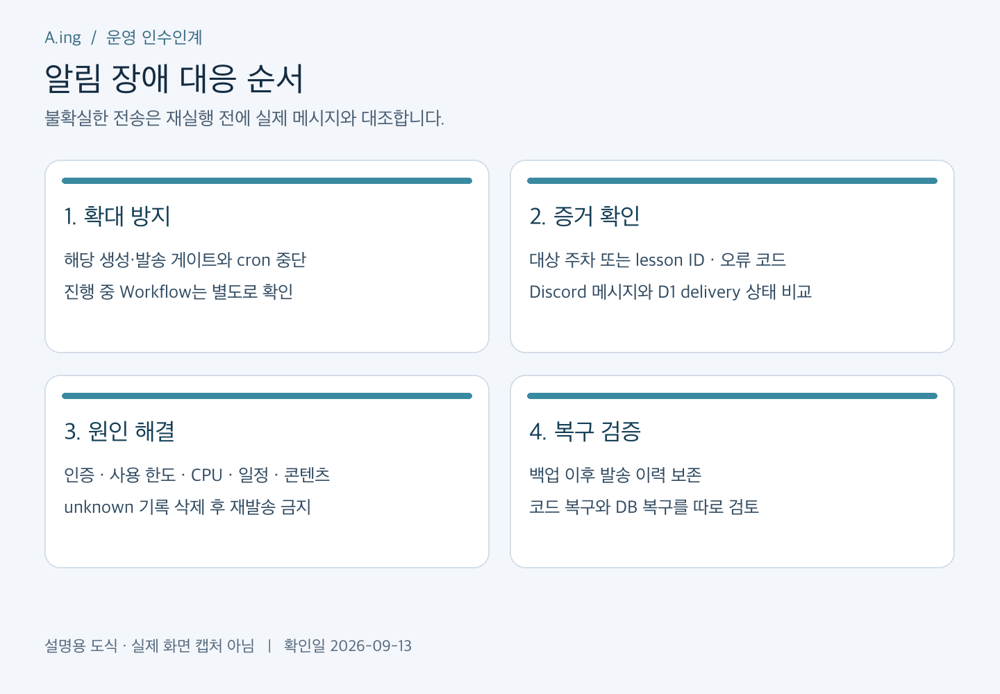

# 운영·장애 대응·복구

확인일: 2026-09-13. 현재 Cloudflare 구현 기준. GAS 운영 기록은 [과거 문서](archive/gas/OPERATIONS.md)에 보존한다.

## 1. 사고가 나면 먼저 할 일



*설명용 도식. 발송 여부가 불확실하면 재발송보다 이력 확인이 먼저다.*

1. 문제가 뉴스인지 개념인지, 어느 주차·lesson·학기인지 기록한다.
2. `cloudflare/wrangler.jsonc`에서 해당 게이트를 false로 설정하고 올바른 계정에 배포한다. cron이 있다면 중단한다.
3. 이미 실행 중인 Workflow는 새 배포 설정만으로 멈추지 않을 수 있으므로 Dashboard에서 상태를 확인하고 필요하면 중단한다.
4. Discord 실제 메시지와 DB의 delivery 상태를 대조한다. `unknown` 또는 `in_flight` 상태를 삭제하거나 즉시 재실행하지 않는다.
5. 마지막 정상 커밋·배포 버전, 발생 시간, 오류 코드와 대상 ID를 기록한다. 키·Webhook·토큰은 기록하지 않는다.

게이트: `LIVE_ENABLED`는 뉴스 유료 생성, `DELIVERY_ENABLED`는 뉴스 발송, `SCHEDULE_ENABLED`는 뉴스 예약, `CONCEPT_TEST_ENABLED`는 개념 테스트, `CONCEPT_SCHEDULE_ENABLED`는 개념 예약이다. 현재 모두 false이며 cron이 없다.

## 2. 증상별 확인

| 증상 | 먼저 확인 | 조치 |
| --- | --- | --- |
| 알림 없음 | 게이트, cron, 활성 학기·시작일 | 현재는 비활성 상태가 정상. 임의 활성화 금지 |
| 관리자 API 401 | 대상 Worker와 관리 토큰 일치 | 토큰을 출력하지 말고 보관 위치와 설정 대조 |
| OpenAI 인증·한도 오류 | 프로젝트 키·결제·사용 한도 | 원인을 고친 뒤 예약 이력을 확인하고 재개 판단 |
| Discord 401/404 | 삭제된 Webhook·잘못된 채널 | 새 Webhook 등록 후 중복 여부 확인 |
| 429/5xx/통신 종료 | API 상태·기존 예약·전송 결과 | 실제 성공 가능성이 있어 무조건 재시도하지 않기 |
| CPU 초과 | Workflow 단계와 Cloudflare 지표 | 작업량·단계 조정 후 Free 환경 재검증 |
| concept missed_slot | 예정 시간보다 6시간 넘게 지연 | 해당 회차를 검토하고 복구 계획 수립 |
| needs_review / unknown | Discord 실제 발송 여부 | 메시지 ID와 DB 상태 대조 후 수동 복구 판단 |
| 콘텐츠 검증 실패 | 길이·필수 섹션·출처·검수 해시 | 원고 수정 후 다시 빌드 |

조회 명령:

```bash
node cloudflare/scripts/weekly.mjs --week 2026-W37 --status
node cloudflare/scripts/weekly.mjs --week 2026-W37 --preview
```

Cloudflare Dashboard의 Workers & Pages, Workflows, D1에서 관련 상태를 확인한다. 로컬 `metrics.mjs`는 복수 계정에서 제한이 있으므로 Dashboard로 확인할 수 있다. 로그와 payload를 공개 Issue에 그대로 붙이지 않는다.

## 3. D1에서 반드시 보존할 기록

- `probe_jobs`, `probe_sources`, `probe_calls`: 생성 작업·자료·API 호출 예약과 결과.
- `weekly_editions`, `weekly_runs`, `weekly_deliveries`: 고정 순위, 주차 실행, 실제 발송 결과.
- `concept_semesters`, `concept_slots`, `concept_deliveries`: 학기 일정과 고정 payload, 발송 결과.
- migration 이력: 적용한 스키마 버전.

`sent`는 이미 보낸 기록이다. `unknown`은 전송 성공 여부를 확정하지 못한 상태이며 미발송과 같지 않다. 테스트를 위해 기록을 지우면 API 중복 비용이나 Discord 중복 메시지가 발생할 수 있다. Workflow와 DB를 한 묶음으로 확인한다.

## 4. 백업과 복구 연습

1. 스키마 변경·계정 이전 전, 정기 점검 때 D1 전체 백업을 만든다.
2. 백업 파일은 비공개 보관하고 생성 시간·대상 DB·담당자·검증 결과를 별도 기록한다.
3. 복구 연습은 운영 DB가 아닌 빈 테스트 DB에서 수행한다. 발송 Secrets와 cron을 연결하지 않는다.
4. 테이블별 행 수, 발송 메시지 ID, 학기 슬롯, migration 이력을 비교한다.
5. 운영 복구 시 백업 이후 발송된 메시지를 먼저 대조한다. 과거 스냅샷 복원으로 최근 발송 기록을 지우지 않는다.

구체적인 export/import 명령은 [계정 이전 가이드](ACCOUNT_MIGRATION.md)에 있다. 코드 rollback은 D1·Secrets·외부 메시지를 되돌리지 않는다. 새 스키마와 이전 코드의 호환성도 확인해야 한다.

## 5. 운영 시작 전 남은 작업

- 36편의 실제 검수·승인과 production 빌드 통과.
- 학기 시작일·시험 기간 확정, 학기 등록·활성화 도구 정리.
- 뉴스 월요일 / 개념 월·수·금 cron의 분기와 오류 격리 검증.
- 뉴스 생성 품질과 Free CPU 한도 검증.
- 계정 이전 시 개인 Worker 주소를 사용하는 도구 수정.

현재 `scheduled`는 개념 처리를 먼저 호출한 후 뉴스 처리를 호출하므로 여러 요일 cron을 추가하기 전에 분기와 한쪽 실패의 영향을 검증해야 한다. 운영 문서만 보고 게이트를 켜는 단계는 아직 아니다.

## 6. 장애 기록 양식

```text
발생 시간(KST):
대상: 뉴스 주차 / 개념 lesson·학기
증상과 오류 코드:
마지막 정상 커밋·배포 버전:
Discord 실제 발송 여부와 메시지 ID:
DB 상태:
중단·복구 조치:
검증 결과:
재발 방지 작업과 담당자:
```

비밀 값과 원본 DB 백업은 이 양식에 넣지 않는다. [평상시 유지보수](MAINTENANCE_GUIDE.md)로 돌아간다.
